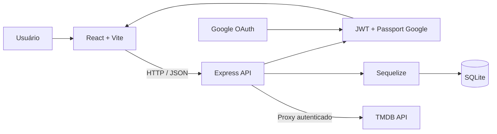
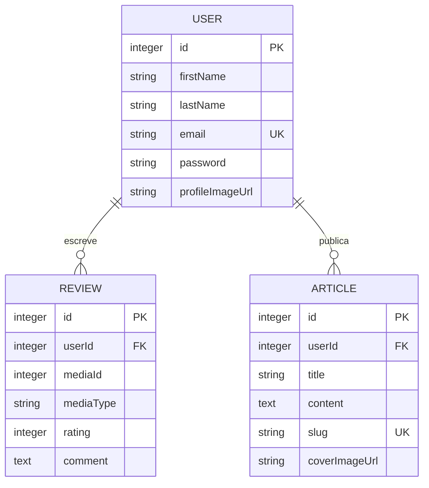

# Central Crítica

[](#estado-atual)

Plataforma full-stack para descobrir filmes e séries, publicar críticas e
produzir artigos sobre audiovisual. O projeto foi desenvolvido na disciplina
de Desenvolvimento Web do curso de Análise e Desenvolvimento de Sistemas e
evoluiu de uma landing page para uma aplicação React integrada a API REST,
banco relacional, autenticação e dados do TMDB.

## Visão geral

A Central Crítica reúne três experiências no mesmo produto:

1. descoberta de filmes e séries por popularidade, gênero, data e pesquisa;
2. participação da comunidade por avaliações de 1 a 5 estrelas e comentários;
3. publicação editorial de artigos com conteúdo rico e páginas por slug.

O navegador não acessa o TMDB diretamente. O frontend chama o backend Express,
que mantém a chave da API no servidor, consulta o TMDB e devolve os resultados.
Dados próprios — usuários, críticas e artigos — são persistidos em SQLite por
meio do Sequelize.

## Objetivo

Oferecer um espaço para amantes de cinema, séries e cultura pop encontrarem
obras, registrarem suas percepções e desenvolverem discussões mais profundas do
que uma simples nota agregada.

## Público-alvo

- espectadores que procuram o próximo filme ou série para assistir;
- usuários que desejam manter um histórico das próprias críticas;
- leitores interessados em análises e textos sobre audiovisual;
- autores que desejam publicar e administrar artigos na plataforma.

## Escopo implementado

- catálogo de filmes e séries populares fornecido pelo TMDB;
- descoberta com ordenação, gêneros e paginação;
- pesquisa conjunta de filmes e séries;
- detalhes da obra, elenco e vídeos em modal;
- cadastro e login por e-mail e senha;
- autenticação social com Google OAuth 2.0;
- autorização de rotas privadas com JWT de uma hora;
- criação de uma crítica por usuário e mídia;
- histórico de críticas do usuário autenticado;
- listagem, leitura, criação, edição e exclusão de artigos;
- verificação de autoria antes de alterar ou excluir artigos;
- geração de slug único para artigos;
- temas claro e escuro e layout responsivo.

## Fora do escopo atual

- painel administrativo e moderação de conteúdo;
- recuperação ou redefinição de senha;
- edição e exclusão de críticas;
- favoritos, listas pessoais ou sistema de seguidores;
- upload próprio de imagens — os modelos recebem URLs;
- suíte automatizada de testes;
- implantação e banco de dados gerenciado para produção.

## Arquitetura



O frontend concentra navegação, estado de autenticação, filtros e apresentação.
O backend aplica validações, verifica autoria, assina tokens e protege as
credenciais dos serviços externos. O SQLite atende ao contexto acadêmico e ao
desenvolvimento local sem exigir um servidor de banco separado.

### Responsabilidades principais

| Componente | Responsabilidade |
|---|---|
| `frontend/src/App.jsx` | Declara rotas da interface e controla o modal global de mídia. |
| `frontend/src/pages/` | Implementa home, catálogo, busca, autenticação, críticas e jornal. |
| `frontend/src/components/` | Reúne navbar, cards, filtros, paginação, modal e seções da home. |
| `frontend/src/contexts/AuthContext.jsx` | Mantém sessão, login, cadastro e usuário no navegador. |
| `frontend/src/contexts/GenreContext.jsx` | Carrega e compartilha gêneros de filmes e séries. |
| `backend/server.js` | Configura Express, CORS, sessão, banco e proxy do TMDB. |
| `backend/routes/auth.js` | Cadastro, login, emissão de JWT e callbacks OAuth. |
| `backend/routes/reviews.js` | Criação e consulta de críticas. |
| `backend/routes/articles.js` | CRUD de artigos e autorização por autoria. |
| `backend/middleware/authMiddleware.js` | Valida `Authorization: Bearer <token>`. |
| `backend/config/passport-setup.js` | Integra Google OAuth e provisiona usuários sociais. |
| `backend/models/` | Define entidades, validações, hooks e relacionamentos Sequelize. |

## Fluxos principais

### Descoberta de mídia

1. a interface solicita filmes, séries, gêneros, busca ou detalhes ao backend;
2. o backend valida os parâmetros e acrescenta a chave TMDB no servidor;
3. o TMDB retorna os dados em português do Brasil;
4. a API devolve JSON e a interface exibe cards, filtros, paginação ou modal;
5. resultados de busca que não sejam filme ou série são descartados.

### Autenticação por senha

1. o cadastro valida nome, sobrenome, e-mail e senha mínima de oito caracteres;
2. o hook do modelo gera hash bcrypt antes de persistir a senha;
3. no login, o hash é comparado e a API emite um JWT válido por uma hora;
4. rotas privadas extraem o usuário do token antes de executar a operação.

### Autenticação Google

1. `/api/auth/google` inicia o fluxo no provedor;
2. o callback procura um usuário pelo e-mail retornado;
3. se necessário, cria a conta com uma senha interna aleatória e criptográfica;
4. o backend emite JWT e redireciona para `/auth/callback` no frontend.

### Publicação de conteúdo

- cada usuário pode publicar somente uma crítica para o mesmo `mediaId` e
  `mediaType`; a API responde `409` quando já existe uma;
- artigos recebem slug derivado do título e sufixo incremental em caso de
  colisão;
- edição e exclusão procuram o artigo pelo slug e comparam `userId` com o autor
  autenticado antes de gravar qualquer mudança.

## Modelo de dados



`mediaId` referencia o identificador externo do TMDB; filmes e séries são
diferenciados por `mediaType` (`movie` ou `tv`) e não são copiados para tabelas
locais.

## Rotas da aplicação

| Caminho | Tela |
|---|---|
| `/` | Página inicial e conteúdos em alta. |
| `/filmes` | Catálogo filtrável de filmes. |
| `/series` | Catálogo filtrável de séries. |
| `/search` | Resultados da busca. |
| `/auth` | Cadastro e login. |
| `/auth/callback` | Conclusão do login Google. |
| `/minhas-criticas` | Histórico do usuário autenticado. |
| `/jornal` | Lista de artigos. |
| `/jornal/:slug` | Leitura de artigo. |
| `/escrever-artigo` | Criação de artigo. |
| `/jornal/editar/:slug` | Edição de artigo existente. |
| `/sobre` | Missão, visão e valores. |

## API REST

Todas as rotas usam o prefixo `/api`, exceto o diagnóstico `GET /`.

### Autenticação

| Método | Endpoint | Acesso | Resultado |
|---|---|---|---|
| POST | `/auth/register` | Público | Cria usuário com senha armazenada via bcrypt. |
| POST | `/auth/login` | Público | Valida credenciais e retorna usuário e JWT. |
| GET | `/auth/google` | Público | Redireciona para o consentimento do Google. |
| GET | `/auth/google/callback` | Público | Provisiona usuário, emite JWT e retorna ao frontend. |

### Críticas

| Método | Endpoint | Acesso | Resultado |
|---|---|---|---|
| POST | `/reviews` | JWT | Cria crítica com `mediaId`, `mediaType`, `rating` e `comment`. |
| GET | `/reviews/:mediaType/:mediaId` | Público | Lista críticas recentes e dados públicos dos autores. |
| GET | `/reviews/my-reviews/all` | JWT | Lista críticas recentes do usuário autenticado. |

### Artigos

| Método | Endpoint | Acesso | Resultado |
|---|---|---|---|
| GET | `/articles` | Público | Lista artigos recentes com seus autores. |
| GET | `/articles/:slug` | Público | Retorna um artigo para leitura. |
| POST | `/articles` | JWT | Publica artigo e gera slug único. |
| PUT | `/articles/:slug` | JWT + autor | Atualiza título e conteúdo. |
| DELETE | `/articles/:slug` | JWT + autor | Exclui o artigo. |

### Proxy TMDB

| Método | Endpoint | Finalidade |
|---|---|---|
| GET | `/movies/popular` | Filmes populares. |
| GET | `/series/popular` | Séries populares. |
| GET | `/genres/movie` | Gêneros de filmes. |
| GET | `/genres/tv` | Gêneros de séries. |
| GET | `/discover/movie` | Filmes por ordenação, gênero e página. |
| GET | `/discover/tv` | Séries por ordenação, gênero e página. |
| GET | `/details/:mediaType/:mediaId` | Detalhes, créditos e vídeos. |
| GET | `/search?query=...&page=...` | Busca conjunta de filmes e séries. |

## Tecnologias

| Camada | Tecnologias |
|---|---|
| Interface | React 18, React Router 6, Vite 6 e Tailwind CSS 3. |
| Conteúdo | React Quill, React Dropzone e React Responsive Carousel. |
| API | Node.js, Express 5, Axios e CORS. |
| Segurança | bcryptjs, JSON Web Token, Passport e Google OAuth 2.0. |
| Dados | Sequelize 6 e SQLite 3. |
| Desenvolvimento | ESLint, Nodemon, npm e Git. |

## Estrutura do projeto

```text
central-critica-fullstack/
├── backend/
│   ├── config/
│   │   ├── config.json
│   │   └── passport-setup.js
│   ├── middleware/
│   │   └── authMiddleware.js
│   ├── models/
│   │   ├── article.js
│   │   ├── index.js
│   │   ├── review.js
│   │   └── user.js
│   ├── routes/
│   │   ├── articles.js
│   │   ├── auth.js
│   │   └── reviews.js
│   ├── .env.example
│   ├── package.json
│   └── server.js
├── frontend/
│   ├── public/
│   ├── src/
│   │   ├── components/
│   │   ├── contexts/
│   │   ├── pages/
│   │   ├── App.jsx
│   │   ├── index.css
│   │   └── main.jsx
│   ├── package.json
│   ├── tailwind.config.js
│   └── vite.config.js
├── .gitignore
└── README.md
```

## Execução local

### Pré-requisitos

- Node.js 18 ou superior;
- npm;
- Git;
- chave de API do TMDB;
- Client ID e Client Secret do Google para habilitar o OAuth.

### Instalação

```bash
git clone https://github.com/g-f307/central-critica-fullstack.git
cd central-critica-fullstack
cd backend && npm install
cd ../frontend && npm install
```

### Configuração

Copie o exemplo e substitua apenas os valores locais:

```bash
cp backend/.env.example backend/.env
```

| Variável | Obrigatória | Uso |
|---|---|---|
| `TMDB_API_KEY` | Sim | Autentica consultas realizadas pelo proxy TMDB. |
| `JWT_SECRET` | Sim em produção | Assina e valida tokens da aplicação. |
| `SESSION_SECRET` | Sim em produção | Protege a sessão temporária usada pelo Passport. |
| `FRONTEND_URL` | Não | Origem CORS e destino dos redirects; padrão `http://localhost:5173`. |
| `GOOGLE_CLIENT_ID` | Para OAuth | Identificador do cliente Google. |
| `GOOGLE_CLIENT_SECRET` | Para OAuth | Segredo do cliente Google. |
| `PORT` | Não | Porta do backend; padrão `5000`. |
| `NODE_ENV` | Não | Ativa regras de produção quando igual a `production`. |

No Google Cloud Console, configure o redirect autorizado como
`http://localhost:5000/api/auth/google/callback` para o ambiente local.

### Inicialização

Terminal do backend:

```bash
cd backend
npm run dev
```

Terminal do frontend:

```bash
cd frontend
npm run dev
```

| Serviço | Endereço local |
|---|---|
| Frontend | `http://localhost:5173` |
| Backend | `http://localhost:5000` |

O backend cria e sincroniza o arquivo SQLite automaticamente ao iniciar.

## Estado atual

O build de produção do frontend é concluído com sucesso. O lint ainda acusa
problemas preexistentes, principalmente imports React não utilizados, ausência
de validação de propriedades e duas advertências de Fast Refresh. O bundle
principal também ultrapassa 500 kB e pode ser dividido com carregamento tardio.

## Segurança e fragilidades superficiais

### Corrigido nesta revisão

- `backend/.env` foi removido do índice do Git e permanece somente na máquina;
- `.env` e variações passaram a ser ignorados na raiz e no backend;
- `backend/.env.example` documenta a configuração sem conter credenciais;
- produção falha ao iniciar sem `JWT_SECRET` e `SESSION_SECRET`;
- CORS e redirects OAuth usam `FRONTEND_URL` em vez de origem fixa;
- cookie de sessão usa `secure` e `sameSite=none` em produção;
- o token do callback OAuth é codificado antes de entrar na URL;
- contas Google recebem senha interna gerada por `crypto.randomBytes`.

### Ações obrigatórias após a exposição do `.env`

Remover o arquivo do commit atual não invalida segredos presentes no histórico.
As chaves que já estiveram no repositório devem ser consideradas comprometidas:

1. revogue e gere novamente a chave do TMDB;
2. gere novos `JWT_SECRET` e `SESSION_SECRET`;
3. revogue e recrie o Client Secret do Google OAuth;
4. atualize somente o `backend/.env` local;
5. se necessário, limpe o histórico com uma ferramenta apropriada e coordene o
   novo clone do repositório com todos os colaboradores.

### Limitações remanescentes

- a base URL do backend está repetida como `http://localhost:5000` no frontend;
  uma implantação deve centralizá-la em `VITE_API_URL`;
- não há rate limiting, headers de segurança com Helmet nem limite explícito
  menor para corpos JSON;
- o JWT é entregue ao frontend pela query string do callback OAuth, podendo
  aparecer no histórico do navegador ou em logs intermediários;
- a chave TMDB é enviada ao provedor por query string;
- artigos aceitam HTML do editor e precisam de sanitização rigorosa antes de
  uma exposição pública;
- `sequelize.sync()` não substitui migrações versionadas em produção;
- não existem testes automatizados para autenticação, autorização ou validações.

## Screenshots

<p align="center">
  
  
</p>
<p align="center"><i>Página Inicial e alternância para o modo escuro</i></p>

<p align="center">
  
  
</p>
<p align="center"><i>Segmento em alta com opção de alternância</i></p>

<p align="center">
  
  
</p>
<p align="center"><i>Tela de Autenticação</i></p>

<p align="center">
  
  
</p>
<p align="center"><i>Visualização de página dedicada por tipo de mídia (Filmes como exemplar)</i></p>

<p align="center">
  
  
</p>
<p align="center"><i>Página de Artigos e Visualização de Artigo</i></p>

<p align="center">
  
  
</p>
<p align="center"><i>Editor de texto para criação de artigos</i></p>

## Referências

- [TMDB API Documentation](https://developer.themoviedb.org/docs)
- [Google Identity — Web guides](https://developers.google.com/identity/gsi/web/guides/overview)
- [Express documentation](https://expressjs.com/)
- [Sequelize documentation](https://sequelize.org/docs/v6/)
